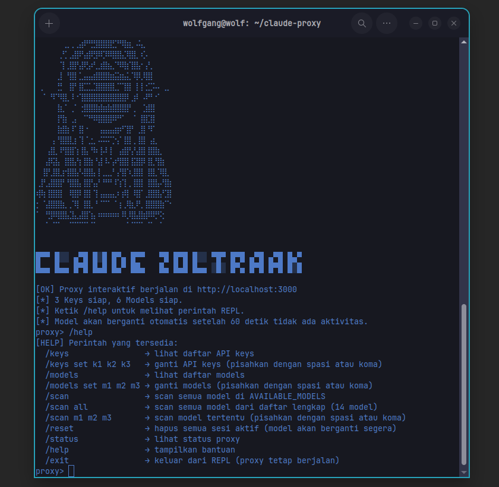

<p align="center">  </p>
# ⚔️ Claude Zoltraak

### *"Menembus Batasan Rate Limit dengan Sihir Pemusnah"*

[](https://nodejs.org/)
[](https://opensource.org/licenses/MIT)
[](https://openrouter.ai/)
[](http://makeapullrequest.com)

---

## 📖 Tentang

**Claude Zoltraak** adalah *smart gateway* dan *local proxy* yang dirancang untuk **Claude Code CLI**. Ia bertindak sebagai lapisan intelijen di antara CLI dan OpenRouter API, menangani **rotasi API key otomatis**, **fallback model cerdas**, dan **session consistency** — tanpa perlu intervensi manual.

> Nama **Zoltraak** terinspirasi dari anime *Frieren: Beyond Journey's End*—mantra ofensif paling efisien yang mampu menembus pertahanan apapun. Seperti namanya, tools ini menembus batasan rate limit dan kuota harian, memastikan alur kerjamu tak pernah terputus.

---

## 🎯 Masalah yang Diselesaikan

| Masalah                              | Dampak                         | Solusi Zoltraak        |
| :----------------------------------- | :----------------------------- | :--------------------- |
| **Rate Limit (429)**                 | Alur coding terputus           | Rotasi key otomatis    |
| **Kuota model gratis habis**         | Tidak bisa melanjutkan         | Fallback ke model lain |
| **Single point of failure**          | 1 key mati = workflow berhenti | Multiple key support   |
| **Edit konfigurasi manual**          | Repot & buang waktu            | REPL interaktif        |
| **Tidak tahu model mana yang aktif** | Sulit debugging                | Log jelas + scanner    |

---

## ✨ Fitur

| Fitur                             | Deskripsi                                                                                        |
| :-------------------------------- | :----------------------------------------------------------------------------------------------- |
| **🔄 Rotasi API Key Otomatis**    | Mendeteksi error `429`, `401`, `403` dan langsung beralih ke key berikutnya.                     |
| **🔁 Rotasi Model Otomatis**      | Jika model gagal atau kehabisan kuota, proxy akan mencoba model alternatif.                      |
| **🔒 Session Consistency**        | Satu sesi Claude Code tetap menggunakan model yang sama agar tool calling tetap stabil.          |
| **📟 REPL Interaktif**            | Kelola konfigurasi (`/keys`, `/models`, `/scan`, `/reset`) langsung dari terminal tanpa restart. |
| **🔍 Model Availability Scanner** | Cek model gratis mana yang aktif untuk setiap API key.                                           |
| **📡 Streaming Support**          | Mendukung streaming response secara real-time.                                                   |
| **🖥️ Cross-Platform**            | Berjalan di **Linux**, **Windows**, dan **macOS** (via WSL).                                     |

---

## 📦 Prasyarat

* **Node.js** v18 atau lebih baru ([Download](https://nodejs.org/))
* **NPM** (biasanya ikut Node.js)
* **Koneksi internet** untuk mengakses OpenRouter API
* **Akun OpenRouter** dengan minimal 1 API key — [Daftar di sini](https://openrouter.ai/)

---

# 🚀 Instalasi & Penggunaan

## 1. Install Claude Code CLI

Claude Zoltraak digunakan sebagai proxy untuk **Claude Code CLI**, sehingga Claude Code perlu di-install terlebih dahulu.

### 🐧 Linux (Bash)

```bash
curl -fsSL https://claude.ai/install.sh | bash
```

### Alternatif menggunakan NPM

```bash
npm install -g @anthropic-ai/claude-code
```

---

### 🪟 Windows (PowerShell)

```powershell
irm https://claude.ai/install.ps1 | iex
```

### Alternatif (CMD)

```cmd
curl -fsSL https://claude.ai/install.cmd -o install.cmd && install.cmd && del install.cmd
```

---

### 🍎 macOS (Bash)

```bash
curl -fsSL https://claude.ai/install.sh | bash
```

### Alternatif menggunakan Homebrew

```bash
brew install claude-code
```

### Alternatif menggunakan NPM

```bash
npm install -g @anthropic-ai/claude-code
```

> **💡 Catatan:** Jika perintah `claude` tidak dikenali setelah instalasi, tambahkan `~/.local/bin` ke `PATH` pada Linux/macOS atau `%USERPROFILE%\.local\bin` pada Windows. Kamu juga dapat mencoba me-restart terminal setelah instalasi.

---

# 2. Install Claude Zoltraak (Proxy)

## 📥 Clone Repository

Clone repository Claude Zoltraak dari GitHub:

```bash
git clone https://github.com/AdityaWilldan/claude-zoltraak.git
cd claude-zoltraak
```

## 📦 Install Dependencies

Install seluruh dependency Node.js yang diperlukan:

```bash
npm install
```

---

## 🔧 Menyimpan API Key

Claude Zoltraak membutuhkan API key dari OpenRouter.

**Disarankan menggunakan file `.env`** agar API key tidak perlu ditulis langsung di dalam source code.

Buat file `.env` di root folder project:

### Linux / macOS

```bash
echo "OPENROUTER_KEYS=sk-or-v1-xxx,sk-or-v1-yyy,sk-or-v1-zzz" > .env
```

### Windows (PowerShell)

```powershell
"OPENROUTER_KEYS=sk-or-v1-xxx,sk-or-v1-yyy,sk-or-v1-zzz" | Out-File -FilePath .env -Encoding utf8
```

> Ganti `sk-or-v1-xxx`, `sk-or-v1-yyy`, dan `sk-or-v1-zzz` dengan API key OpenRouter milikmu.

### Install `dotenv`

Jika project belum memiliki package `dotenv`, jalankan:

```bash
npm install dotenv
```

Kemudian pada `proxy.js`, gunakan:

```javascript
require('dotenv').config();

let API_KEYS = process.env.OPENROUTER_KEYS
  ? process.env.OPENROUTER_KEYS.split(',')
  : [];
```

### ⚠️ Keamanan API Key

Jangan pernah meng-upload API key ke GitHub.

Tambahkan `.env` ke `.gitignore`:

```gitignore
.env
```

Jika API key sudah terlanjur ter-push ke repository publik, segera **revoke/delete key tersebut dari OpenRouter** dan buat key baru.

---

# 3. Konfigurasi Claude Code untuk Menggunakan Proxy

Claude Code perlu diarahkan agar seluruh request-nya melewati Claude Zoltraak.

Buat file:

```text
~/.claude/settings.json
```

## 🐧 Linux / macOS

```bash
mkdir -p ~/.claude
nano ~/.claude/settings.json
```

Atau menggunakan VS Code:

```bash
code ~/.claude/settings.json
```

---

## 🪟 Windows (PowerShell)

```powershell
mkdir %USERPROFILE%\.claude
notepad %USERPROFILE%\.claude\settings.json
```

## 🪟 Windows (CMD)

```cmd
mkdir %USERPROFILE%\.claude
notepad %USERPROFILE%\.claude\settings.json
```

Kemudian isi `settings.json` dengan:

```json
{
  "model": "minimax/minimax-m3:free",
  "env": {
    "ANTHROPIC_BASE_URL": "http://localhost:3000",
    "ANTHROPIC_AUTH_TOKEN": "",
    "ANTHROPIC_API_KEY": ""
  }
}
```

### Penjelasan konfigurasi

| Variable               | Fungsi                                                    |
| :--------------------- | :-------------------------------------------------------- |
| `model`                | Model OpenRouter yang digunakan sebagai model awal        |
| `ANTHROPIC_BASE_URL`   | Mengarahkan Claude Code ke proxy lokal                    |
| `ANTHROPIC_AUTH_TOKEN` | Dikosongkan karena autentikasi ditangani oleh proxy       |
| `ANTHROPIC_API_KEY`    | Dikosongkan karena API key OpenRouter dikelola oleh proxy |

---

# 4. Konfigurasi `proxy.js`

Jika tidak menggunakan `.env`, buka `proxy.js` dan masukkan API key OpenRouter secara langsung:

```javascript
let API_KEYS = [
  'sk-or-v1-xxxxx',
  'sk-or-v1-yyyyy',
  'sk-or-v1-zzzzz'
];
```

Ganti placeholder tersebut dengan API key OpenRouter milikmu.

### ⭐ Recommended: Menggunakan `.env`

Jika menggunakan `.env`, konfigurasi menjadi:

```javascript
require('dotenv').config();

let API_KEYS = process.env.OPENROUTER_KEYS
  ? process.env.OPENROUTER_KEYS.split(',')
  : [];
```

Pastikan dependency `dotenv` sudah ter-install:

```bash
npm install dotenv
```

---

# 5. Jalankan Proxy

Setelah konfigurasi selesai, jalankan Claude Zoltraak:

```bash
node proxy.js
```

Jika berhasil, kamu akan melihat banner ASCII dan prompt interaktif seperti:

```text
proxy>
```

Proxy sekarang berjalan pada:

```text
http://localhost:3000
```

> **⚠️ Jangan tutup terminal ini.** Proxy harus tetap berjalan agar Claude Code dapat berkomunikasi dengan OpenRouter melalui Claude Zoltraak.

---

# 6. Jalankan Claude Code

Buka **terminal baru**, kemudian jalankan:

```bash
claude
```

Jika konfigurasi berhasil, Claude Code akan menggunakan:

```text
Claude Code
     ↓
Claude Zoltraak
     ↓
OpenRouter
     ↓
Model AI
```

Dengan demikian, request Claude Code akan melewati proxy dan dapat memanfaatkan fitur:

* 🔄 Automatic API key rotation
* 🔁 Model fallback
* 🔒 Session consistency
* 🔍 Model availability scanner
* 📡 Streaming response

---

# 7. Verifikasi Proxy Berjalan dengan Baik

Untuk memastikan proxy dapat menerima request, kamu dapat melakukan test menggunakan `curl`.

```bash
curl -X POST http://localhost:3000/v1/chat/completions \
  -H "Content-Type: application/json" \
  -d '{
    "model": "minimax/minimax-m3:free",
    "messages": [
      {
        "role": "user",
        "content": "Halo"
      }
    ],
    "max_tokens": 5
  }'
```

Jika proxy berjalan dengan baik, kamu akan mendapatkan response JSON dari OpenRouter.

Contoh:

```json
{
  "id": "gen-xxxxxxxx",
  "model": "minimax/minimax-m3:free",
  "choices": [
    {
      "message": {
        "role": "assistant",
        "content": "Halo!"
      }
    }
  ]
}
```

Model yang digunakan dapat berbeda apabila Claude Zoltraak melakukan **model fallback**.

---

# 🛠️ REPL Commands

Claude Zoltraak menyediakan REPL interaktif untuk mengelola proxy secara langsung.

| Command    | Fungsi                            |
| :--------- | :-------------------------------- |
| `/keys`    | Melihat dan mengelola API key     |
| `/models`  | Melihat model yang tersedia       |
| `/scan`    | Melakukan scan model availability |
| `/reset`   | Mereset konfigurasi/session       |
| `Ctrl + C` | Menghentikan proxy                |

Contoh:

```text
proxy> /keys
proxy> /models
proxy> /scan
proxy> /reset
```

---

# 🧪 Troubleshooting

### `claude: command not found`

Pastikan Claude Code sudah ter-install dan lokasi binary Claude sudah masuk ke `PATH`.

Linux/macOS:

```bash
echo $PATH
```

Windows:

```powershell
$env:PATH
```

Kemudian restart terminal jika diperlukan.

---

### `ECONNREFUSED localhost:3000`

Artinya Claude Code mencoba mengakses proxy tetapi proxy belum berjalan.

Pastikan:

```bash
node proxy.js
```

masih berjalan.

---

### `401 Unauthorized` / `403 Forbidden`

Periksa API key OpenRouter yang digunakan.

Pastikan key:

* masih aktif
* tidak salah copy
* memiliki akses ke model yang digunakan
* belum dicabut/revoke

---

### `429 Too Many Requests`

Ini merupakan salah satu kondisi yang ditangani oleh Claude Zoltraak.

Proxy akan mencoba melakukan **rotasi API key** dan/atau **fallback ke model lain** sesuai konfigurasi.

---

### Model tidak tersedia

Gunakan command:

```text
proxy> /scan
```

untuk memeriksa model yang tersedia pada API key.

---

# 🔐 Security Notes

API key OpenRouter merupakan kredensial sensitif. Jangan menyimpan API key di repository publik.

**Recommended:**

```text
.env
```

Tambahkan:

```gitignore
.env
```

ke `.gitignore`.

Jika menggunakan Git, pastikan `.env` tidak ikut ter-commit:

```bash
git status
```

Jika API key pernah terekspos, segera revoke key tersebut melalui dashboard OpenRouter dan generate key baru.

---

# 📁 Project Structure

Struktur dasar project:

```text
claude-zoltraak/
├── proxy.js
├── package.json
├── package-lock.json
├── .env
├── .gitignore
└── README.md
```

> File `.env` bersifat lokal dan **tidak boleh di-commit ke repository**.

---

# 🤝 Contributing

Pull Request sangat terbuka!

Jika kamu memiliki ide, bug fix, atau improvement:

1. Fork repository
2. Buat branch baru
3. Implementasikan perubahan
4. Test perubahan
5. Commit perubahan
6. Buat Pull Request

Contoh:

```bash
git checkout -b feature/my-feature
git add .
git commit -m "feat: add my feature"
git push origin feature/my-feature
```

---

# 📄 License

Project ini menggunakan lisensi **MIT**.

---

## ⚔️ Zoltraak Awaits

> *"Satu key tumbang, yang lain bangkit."*

**Claude Zoltraak** — *Smart Gateway for Claude Code.*
